# Mermaid 图表模板

## 图表类型

### 1. 系统架构图

#### 模板

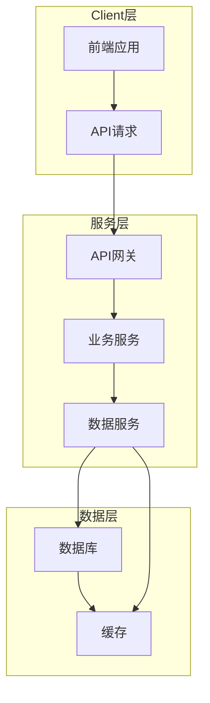

#### 生成规则

- **Client层**: 包含前端应用、移动端等客户端
- **服务层**: 包含API网关、业务服务、数据服务等
- **数据层**: 包含数据库、缓存等数据存储
- **连接线**: 表示数据流向和调用关系

### 2. 模块关系图

#### 模板

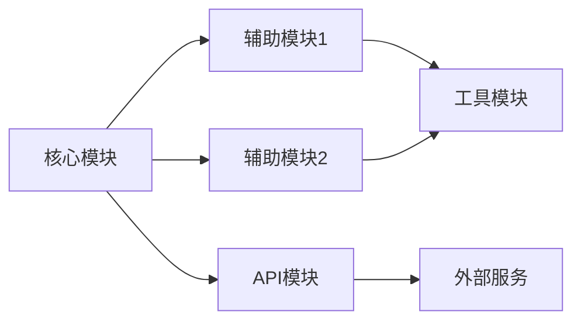

#### 生成规则

- **核心模块**: 项目的主要功能模块
- **辅助模块**: 支持核心模块的功能模块
- **工具模块**: 提供通用功能的模块
- **API模块**: 提供外部接口的模块
- **连接线**: 表示模块间的依赖关系

### 3. 数据流图

#### 模板

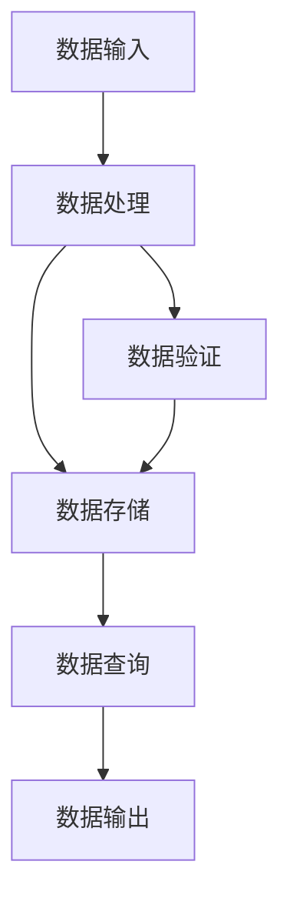

#### 生成规则

- **数据输入**: 数据的来源，如用户输入、API调用等
- **数据处理**: 数据的转换、计算等处理过程
- **数据存储**: 数据的持久化存储
- **数据查询**: 数据的检索和获取
- **数据输出**: 数据的最终去向，如用户界面、API响应等
- **连接线**: 表示数据的流动方向

### 4. 业务流程图

#### 模板

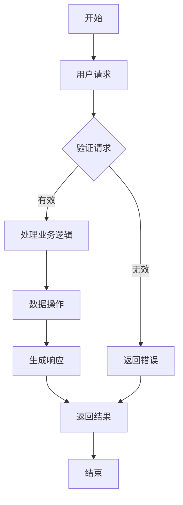

#### 生成规则

- **开始/结束**: 流程的起点和终点
- **处理步骤**: 具体的业务处理逻辑
- **判断节点**: 条件判断
- **连接线**: 表示流程的执行顺序
- **分支**: 基于条件的不同执行路径

### 5. 文件结构树

#### 模板

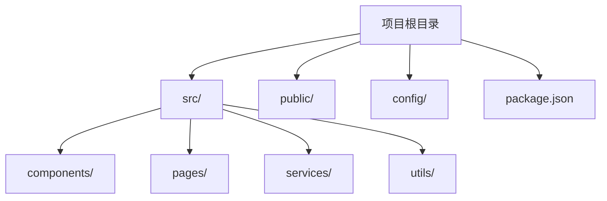

#### 生成规则

- **根目录**: 项目的根文件夹
- **子目录**: 项目的主要目录结构
- **文件**: 重要的配置文件和入口文件
- **连接线**: 表示目录的层级关系

### 6. API调用链

#### 模板

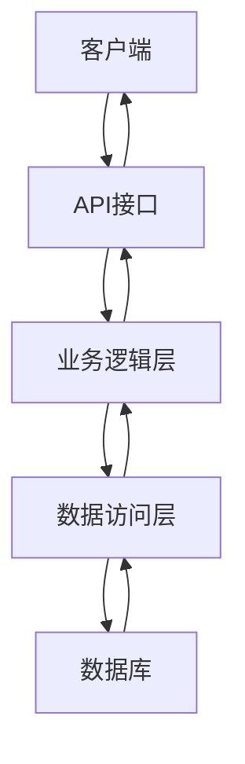

#### 生成规则

- **客户端**: API的调用方
- **API接口**: 提供的API端点
- **业务逻辑层**: 处理业务逻辑的代码
- **数据访问层**: 与数据库交互的代码
- **数据库**: 数据存储
- **连接线**: 表示调用的方向和返回的方向

### 7. 技术栈关系图

#### 模板

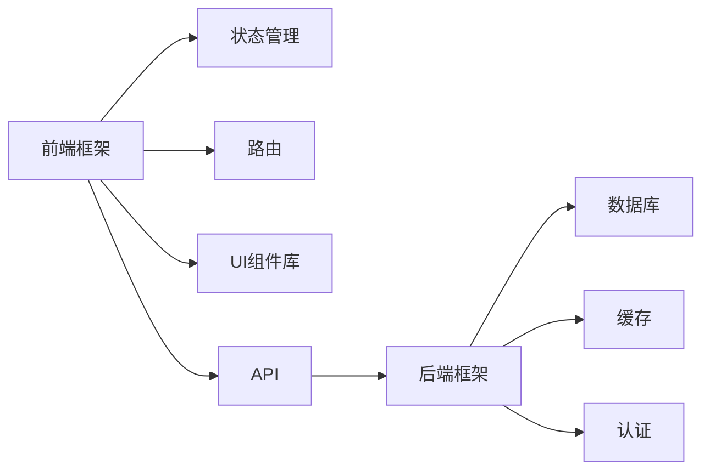

#### 生成规则

- **前端框架**: 如React、Vue等
- **状态管理**: 如Redux、Vuex等
- **路由**: 如React Router、Vue Router等
- **UI组件库**: 如Ant Design、Element UI等
- **后端框架**: 如Express、Django等
- **数据库**: 如MySQL、MongoDB等
- **缓存**: 如Redis等
- **认证**: 如JWT等
- **API**: 前后端通信的接口
- **连接线**: 表示技术间的关系和依赖

### 8. 部署架构图

#### 模板

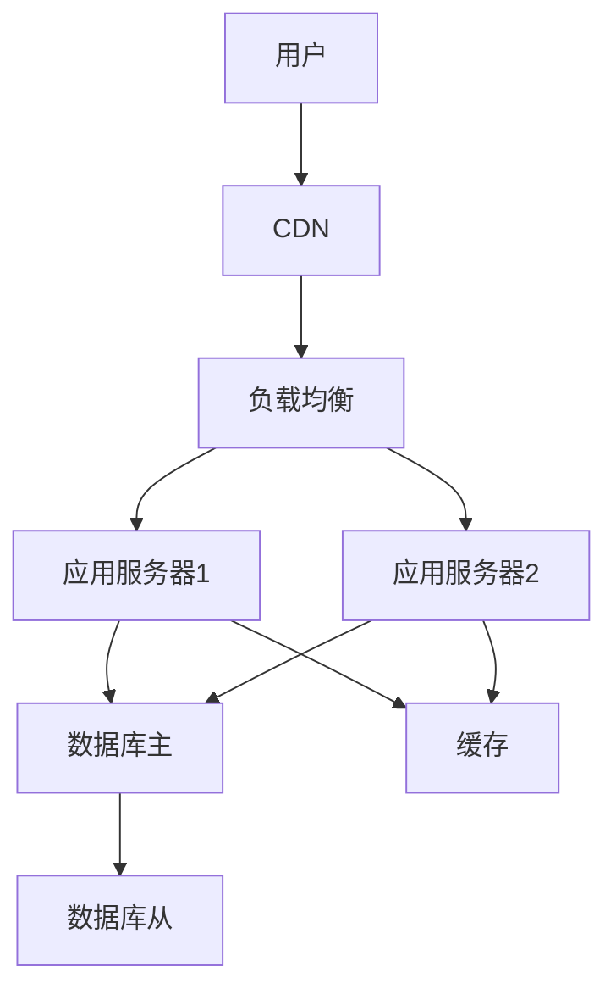

#### 生成规则

- **用户**: 最终用户
- **CDN**: 内容分发网络
- **负载均衡**: 分发请求的负载均衡器
- **应用服务器**: 运行应用代码的服务器
- **数据库主**: 主数据库
- **数据库从**: 从数据库（用于备份和读取）
- **缓存**: 用于提高性能的缓存
- **连接线**: 表示请求的流向和数据的同步

## 图表生成规则

### 1. 自动布局

- **层级关系**: 根据模块的依赖关系自动确定层级
- **节点位置**: 基于模块的重要性和相关性自动调整
- **连接线**: 自动优化连接线的路径，避免交叉

### 2. 节点样式

- **核心模块**: 蓝色填充，粗边框
- **辅助模块**: 绿色填充，细边框
- **工具模块**: 黄色填充，细边框
- **外部服务**: 灰色填充，虚线边框

### 3. 连接线样式

- **强依赖**: 实线，箭头
- **弱依赖**: 虚线，箭头
- **双向依赖**: 双线，双向箭头

### 4. 图表标题

- 每个图表都应有清晰的标题
- 标题应描述图表的内容和用途

### 5. 图表注释

- 复杂图表应添加必要的注释
- 注释应简洁明了，解释关键部分

## 图表使用建议

1. **系统架构图**: 用于展示整个系统的宏观结构
2. **模块关系图**: 用于展示模块间的依赖关系
3. **数据流图**: 用于展示数据在系统中的流动过程
4. **业务流程图**: 用于展示核心业务流程的执行步骤
5. **文件结构树**: 用于展示项目的文件组织
6. **API调用链**: 用于展示API请求的处理过程
7. **技术栈关系图**: 用于展示项目使用的技术栈及其关系
8. **部署架构图**: 用于展示系统的部署结构

## 示例图表

### 系统架构图示例

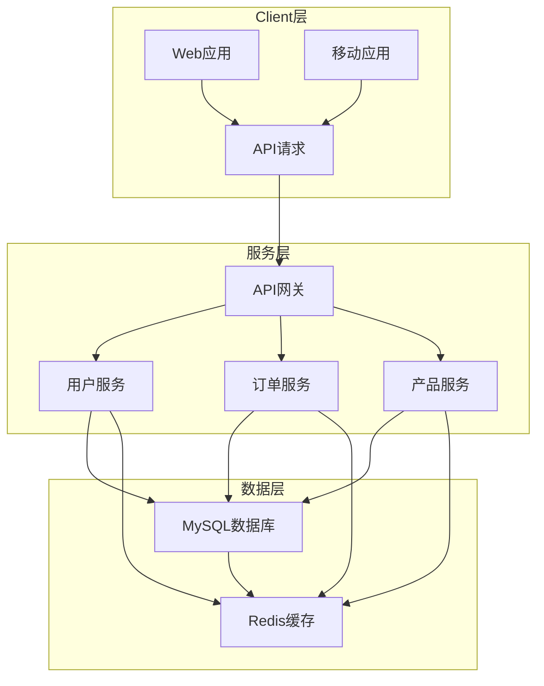

### 模块关系图示例

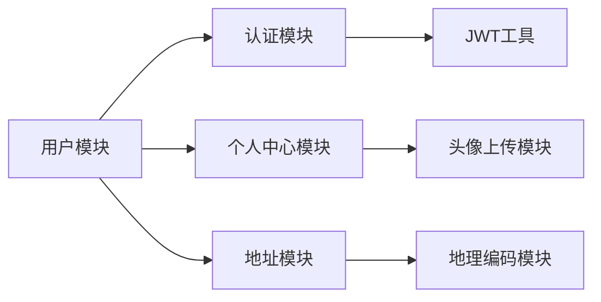

### 数据流图示例

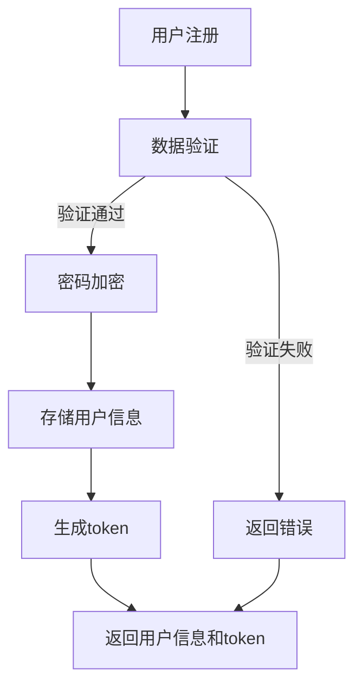